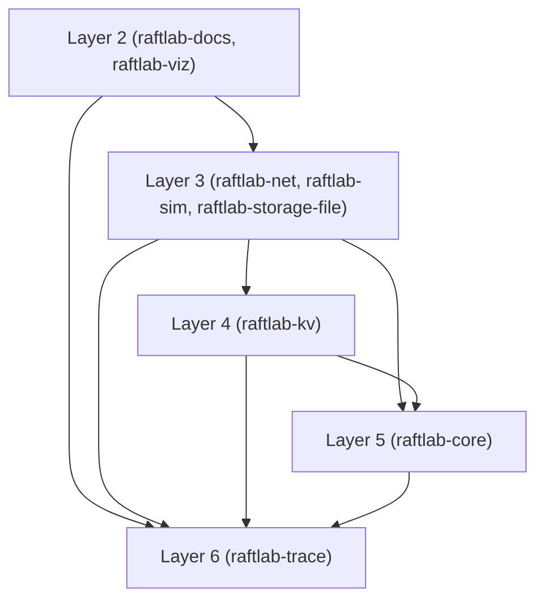

# raftlab

A Raft consensus lab in Kotlin. The full README arrives in a later milestone.

## Architecture

<!-- BEGIN GENERATED:architecture -->

```mermaid
flowchart TB
    n0["Layer 2 (raftlab-docs, raftlab-viz)"]
    n1["Layer 3 (raftlab-net, raftlab-sim, raftlab-storage-file)"]
    n2["Layer 4 (raftlab-kv)"]
    n3["Layer 5 (raftlab-core)"]
    n4["Layer 6 (raftlab-trace)"]
    n0 --> n1
    n0 --> n4
    n1 --> n2
    n1 --> n3
    n1 --> n4
    n2 --> n3
    n2 --> n4
    n3 --> n4
```
<!-- END GENERATED:architecture -->
